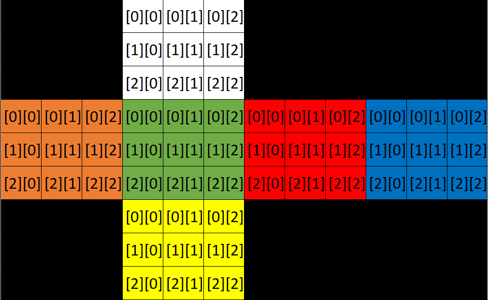

# Py Cube Solver
This project aims to make an app that can help solve a rubiks cube! Not quite sure how I'm going to accomplish that, but I'll cross that bridge when I get to it :)
## Current Dependencies
[See the requirements file.](requirements.txt). To automatically install requirements, run `pip install -r requirements.txt`.

- sty (for colours in the terminal). To install, run `pip install sty`
- PyOpenGL. To install, run `pip install PyOpenGL`
## Array Visualization

