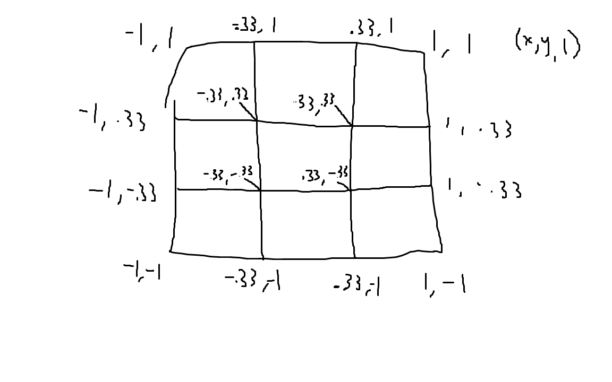
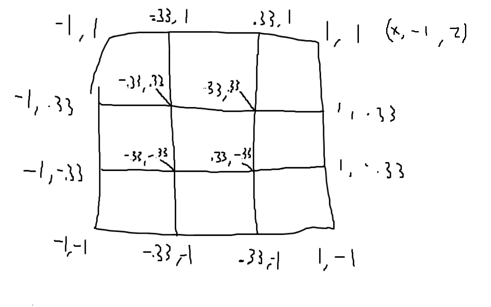

# Py Cube Solver
This project aims to make an app that can help solve a rubiks cube! Not quite sure how I'm going to accomplish that, but I'll cross that bridge when I get to it :)
## Current Dependencies
- sty (for colours in the terminal). To install, run `pip install sty`
- pygame. To install, run `pip install pygame`
- PyOpenGL. To install, run `pip install PyOpenGL`
## Array Visualization

## Vertices Maps
Front:

Back:

Top:

Bottom:

Left:

Right:
